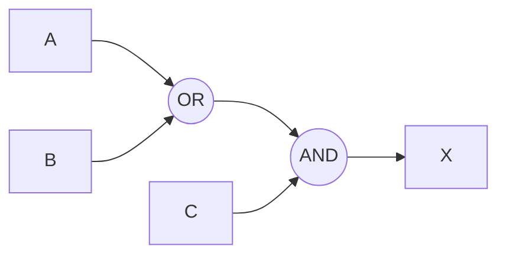

# Testing Mermaid Diagram

The diagram above shows a logic gate circuit where inputs A and B feed into an OR gate, the output of the OR gate and input C feed into an AND gate, and the output of the AND gate is X.
